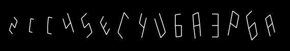
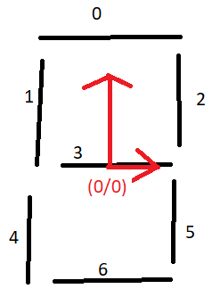
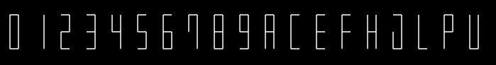

# An easy SVG captcha generator
An example how an easy captcha can be created without fancy libraries and complex code.

# The font
First, we need a font which represents some characters. An easy and very simple is one which can be drawn in maximum of 7 lines, called 7 segment font. It's used by clocks and simple displays. Disadvantage: We can only use some characters of it, otherwise it would be too hard to recognize the right characters.  

Good readable characters are:

0123456789ACEFHJLPU

You need 7 lines to represent all options of this 7 segment font. I defined the origin of the coordinate system in the middle (more later). All lines are described in the variable SEGMENTS. You can say these lines are all normalised.

Every character can be represented now in seven bits. Every bit which is set turns on a segment (or line). The characters are describes in the variable FONT.

# Drawing the captcha

These steps are needed to draw the captcha:

1. A function which takes a string (characters we want to obfuscate)
2. Each character creates a bunch of points
3. These points get now transformed to obfuscate the character. We can turn or increase it easily because the origin of the coordinating system is in the middle.
4. The next step would be to increase the character to a given size and to put it next to each other. The x start position of each character is larger than the character before. Otherwise all characters would be on top of each other.
6. The y coordinate of each point has to transform, cause the y axis begins on top on a SVG picture
7. Draw all lines 

To be continued...
