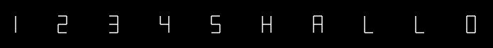

# An easy SVG captcha generator
An example how an easy captcha can be created without fancy libraries and complex code.


# The font
First, we need a font which represents some characters. An easy and very simple is one which can be drawn in maximum of 7 lines, called 7 segment font. It's used by clocks and calculators. Disadvantage: We can only use some characters of it, otherwise it would be too hard to recognize the right characters.  


Good readable characters are:


0123456789ACEFHJLPU

You need 7 lines to represent all options of this 7 segment font. I defined the origin of the coordinate system in the middle (more later). All lines are described in the variable SEGMENTS. These lines are normalised.

Every character can be represented with seven bits. Every bit which is set turns on a segment (or line). The characters are described in the variable FONT.


# Drawing the captcha

These steps are needed to draw the captcha:

1. A function which takes a string (characters we want to obfuscate) (def plot_str)
2. Each character creates a bunch of line points (def create_7segchar)
3. These points get transformed to obfuscate the character. We can turn or increase it easily because the origin of the coordinating system is in the middle (line 56 with line 58, 59).
4. The next step would be to increase the character to a given size (line 15, line 85) and put it next to each other (line 92). The x start position of each character is larger than the character before. Otherwise all characters would be on top of each other.
6. The y coordinate of each point has to transform, cause the y axis begins on top on a SVG picture (line 95)
7. Draw all lines (line 24)

# Going through

First of all we have to create a new object:

```
width = 600
height = 200
a = captcha(width, height)
```

To enter a specific string we have to call

`a.plot_str('12345HALL0')`

This function creates the line-points for all the characters. If the if-block in line 57 is active, all the points will be increased and/or rotated.

The x and y coordinates for each point are translated in complex numbers. If you multiply this with another complex number, a transformation is happening. The j-value rotates and the r value changes the size.

## Example 1
```
(line 58 and 59):
rpart = 1 #(random.random()/2 + 0.5)
ipart = 0 #(1 - random.random() * 2) / 2
```
creates a file names test.svg in the same folder
```
a.plot_str('01234HALL0')
a.output('test.svg')
```
is producing following result:


This is the original image.

## Example 2
```
(line 58 and 59):
rpart = 0 #(random.random()/2 + 0.5)
ipart = 1 #(1 - random.random() * 2) / 2
```
is producing following result:


A multiplication with an imaginary number leads to a rotation.

## Example 2.5
```
(line 58 and 59):
rpart = 0.5 #(random.random()/2 + 0.5)
ipart = 0 #(1 - random.random() * 2) / 2
```
is producing following result:



The scale is decreased.

## Example 3
```
(line 58 and 59):
rpart = (random.random()*1.5)
ipart = (1 - random.random() * 2) / 1.5
```
is producing something like:


That's all of it. You are welcome to improve it. Cheers!
